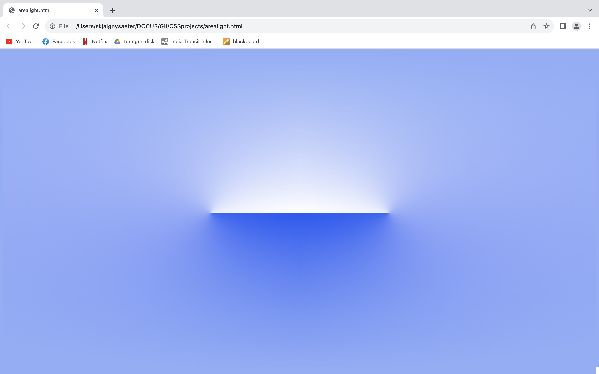
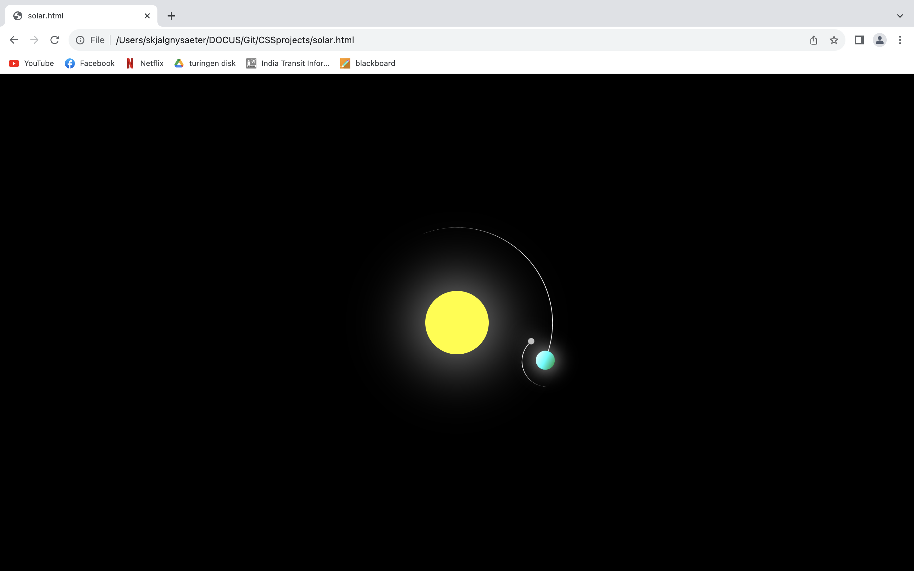

<!-- PROJECT LOGO -->
 

  

  <h3 align="center">Small CSS Projects</h3>

  

    Project spring 2023
  

<!-- ABOUT THE PROJECT -->
## About The Project

Wanted to get better at css ao started watching some tutorials on youtube. Just a freetime project folder for css/html.

  

<!-- GETTING STARTED -->
## Getting Started

Running the program is very easy and requires no special imports or API keys so far. Just clone the project, copy the path to the frontpage and paste it into a chrome browser.

### Built With

* html
* css

<!-- CONTACT -->
## Contact

Skjalg Nysaeter - skjalgn@gmail.com

Project Link: [https://github.com/skjalgn/ProjectSpotify](https://github.com/skjalgn/ProjectSpotify)

(<a href="#readme-top">back to top</a>)

